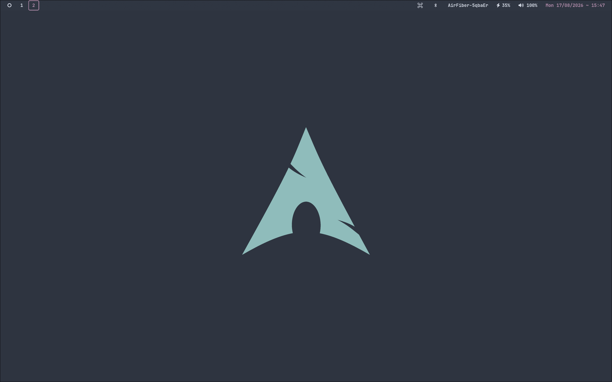
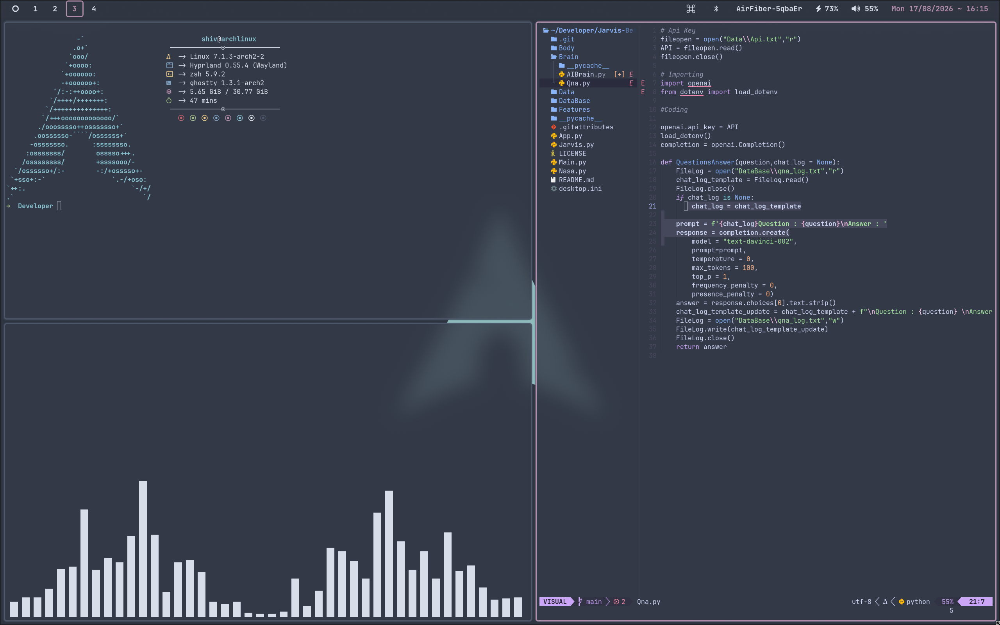
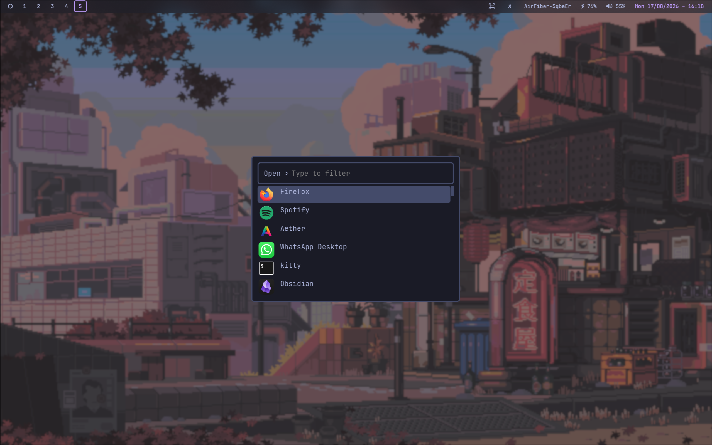
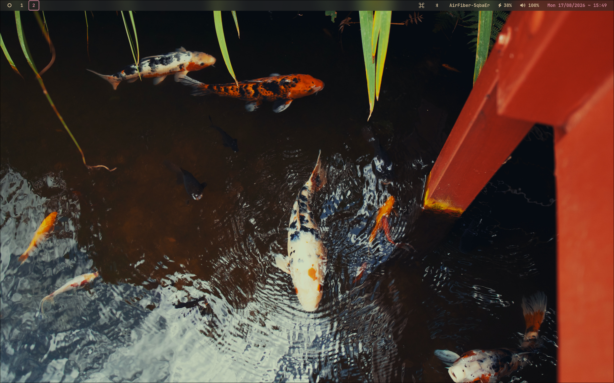

# MyArch

A minimal, keyboard-driven Wayland desktop environment built on Arch Linux and Hyprland. Designed for zero-friction workflows, aesthetic precision, and quiet efficiency.

---

## Overview

This setup is the result of stripping away visual noise and focusing entirely on speed and utility. Every element—from window tiling parameters to custom progress overlays—serves an explicit purpose.

The aesthetic is built around adaptive color schemes generated dynamically from wallpapers, maintaining visual consistency across terminal windows, bar modules, and application launchers.

---

## Preview

### Clean Workspace


A clean view showing the minimal top bar, discrete workspace indicators, and default system state.

### Tiling & Active Workflow


Hyprland dwindle layout managing active windows with clean gaps, border accents, and high-readability typography.

### Application Launcher


Centered application launcher providing fast, fuzzy-search access to applications, system controls, and clipboard history.

### Warm Palette Variant


An alternative warm palette dynamically applied across the entire desktop via the internal theme engine.

---

## System Architecture

### 1. Window Management (Hyprland)
Hyprland operates as the Wayland compositor. Key structural choices:
- Layout: Dwindle layout handles automatic window splitting without manual management.
- Window Rules: Specific utility windows (e.g., floating terminal tools, volume/brightness overlays) are assigned explicit window rules to automatically float, center, and resize without breaking tiling workflows.
- Input Configuration: Acceleration profiles and key repeat rates are tuned for direct, instant response.

### 2. Dynamic Color Engine (Aether & Wallust)
The desktop color scheme adapts automatically to whichever wallpaper is active:
- When a wallpaper is selected, Wallust extracts a dominant color palette.
- Aether applies those colors across configuration files in real time.
- Hyprland border colors, Waybar styles, GTK themes, and terminal color sequences update instantly without restarting the Wayland session.

### 3. Status Bar (Waybar & Quickshell)
The top bar is a lightweight Waybar build configured with custom CSS:
- Left: Workspace selector showing active and populated workspace states.
- Center: Currently focused window title, auto-truncated to preserve visual balance.
- Right: System indicators including network status, battery level, audio volume, and clock.

### 4. On-Screen Display (SwayOSD)
Hardware volume and brightness keys bypass default notify-daemon alerts:
- Custom shell scripts (`vol-osd` and `brightness-osd`) query current hardware state using `wpctl` and `brightnessctl`.
- Values are sent directly to `swayosd-client`, rendering smooth, translucent floating progress bars centered on screen.

### 5. Launchers & System Utilities (Rofi & Viegphunt)
Rofi acts as the core modal interface:
- App Launcher: Launched via `Alt+Space`.
- Clipboard History: Integrates with `wl-paste` and `cliphist` via `Super+V`.
- Wallpaper Selector: Triggered via `Super+W` to browse and select wallpapers with immediate theme regeneration.
- Keybinding Hints: A helper script accessible via `Super+H` listing all active system keybindings.

### 6. Terminal & Shell Environment
- Terminals: Ghostty and Kitty configured with minimal padding, explicit font sizing, and GPU acceleration.
- Shell: Zsh managed via Oh My Zsh with `zsh-autosuggestions` and `zsh-syntax-highlighting`.
- Telemetry: Fastfetch configured for instant system summary upon terminal spawn.

---

## Keybindings

| Keybinding | Action |
| --- | --- |
| `Super + Space` | Open Terminal |
| `Alt + Space` | Application Launcher |
| `Super + Q` | Close active window |
| `Super + F` | Toggle window float mode |
| `Super + V` | Open clipboard manager |
| `Super + W` | Open wallpaper picker |
| `Super + Shift + W` | Set random wallpaper |
| `Super + H` | Display keybinding hints |
| `Super + Shift + S` | Capture region screenshot |
| `Super + L` | Lock screen (Hyprlock) |
| `Super + 1..9` | Switch to workspace 1..9 |

---

## Directory Structure

```
myarch/
├── config/
│   ├── hypr/          # Hyprland compositor & modular configs
│   ├── waybar/        # Top status bar CSS & JSON configs
│   ├── quickshell/    # Quickshell components
│   ├── rofi/          # Application launcher & theme styles
│   ├── swaync/        # Notification center configuration
│   ├── swayosd/       # On-screen display styles
│   ├── ghostty/       # Ghostty terminal config
│   ├── kitty/         # Kitty terminal config
│   ├── fastfetch/     # Telemetry fetch configuration
│   ├── nvim/          # Neovim text editor config
│   └── viegphunt/     # Utility scripts for launcher & wallpaper switching
├── bin/               # Custom shell scripts (OSD controls, floating launchers)
├── wallpapers/        # Selected wallpaper collection
├── screenshots/       # Preview screenshots
├── .zshrc             # Shell runtime configuration
└── README.md
```

---

## Installation & Setup

1. **Clone the repository:**
   ```bash
   git clone https://github.com/your-username/myarch.git ~/myarch
   ```

2. **Copy configuration files:**
   ```bash
   cp -r ~/myarch/config/* ~/.config/
   cp -r ~/myarch/bin/* ~/.local/bin/
   cp ~/myarch/.zshrc ~/.zshrc
   chmod +x ~/.local/bin/*
   ```

3. **Core Dependencies:**
   - Compositor: `hyprland`, `hyprlock`, `hyprshot`
   - Bar & Utilities: `waybar`, `rofi-wayland`, `swaync`, `swayosd-git`, `cliphist`
   - Terminal & Shell: `ghostty` or `kitty`, `zsh`, `fastfetch`
   - Theme & Wallpaper: `wallust`, `awww`

---

## Credits

Inspired by community Hyprland ecosystem projects. Crafted for daily productivity.
